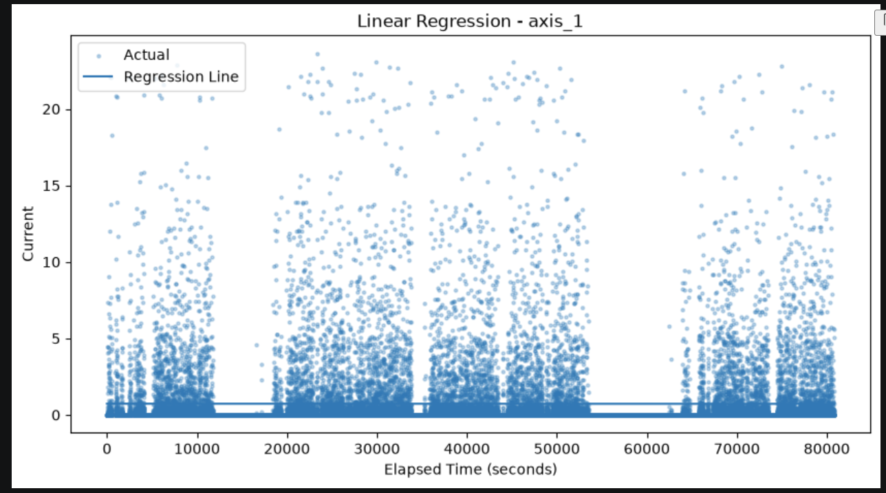
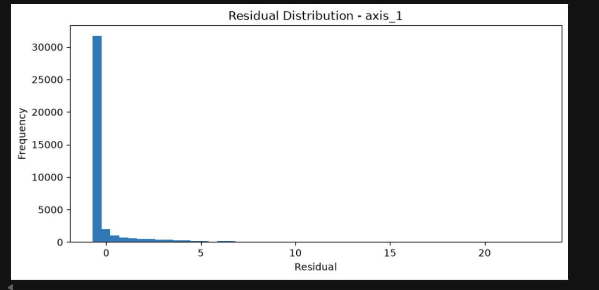
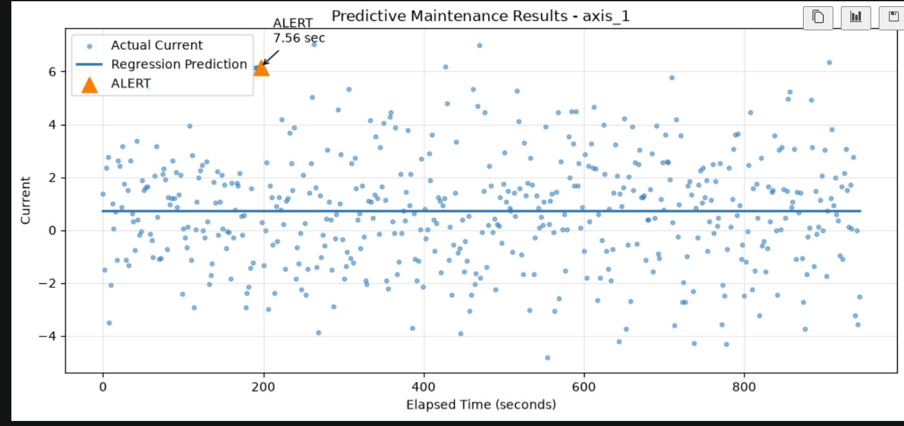
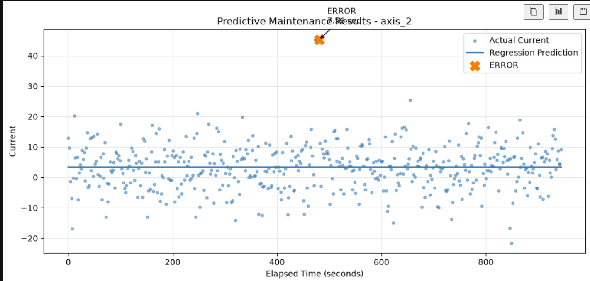

# Robot Predictive Maintenance Using Linear Regression

## Project Overview

This project extends the **Data Stream Visualization Workshop** by adding
a machine learning-based predictive maintenance system for robot current
measurements.

The system uses historical robot data stored in **Neon PostgreSQL** to
train Linear Regression models for eight robot axes. The models establish
the expected current behaviour of each axis over time.

The difference between the actual current and predicted current is
calculated as a **residual**. These residuals are then used to identify
unusual current behaviour that may indicate a maintenance condition.

The project also generates synthetic testing data, simulates streaming
measurements, detects sustained Alert and Error conditions, stores
streamed records in Neon PostgreSQL, logs detected events, and visualizes
the final results.

---

## Project Objectives

The main objectives of this project are to:

- Retrieve historical robot data from Neon PostgreSQL.
- Train separate Linear Regression models for Axes #1–#8.
- Calculate and analyze regression residuals.
- Discover data-driven Alert and Error thresholds.
- Generate synthetic testing data based on historical statistics.
- Standardize synthetic data using the training dataset.
- Simulate streaming robot measurements.
- Detect sustained Alert and Error conditions.
- Log predictive maintenance events.
- Store synthetic streaming records in Neon PostgreSQL.
- Visualize regression predictions and detected maintenance events.

---

## Project Structure

```text
project/
│
├── data/
│   ├── RMBR4-2_export_test.csv
│   ├── synthetic_test_data.csv
│   ├── anomaly_events.csv
│   └── ...
│
├── src/
│   │
│   ├── data_service/
│   │   ├── database_manager.py
│   │   └── datacollection.py
│   │
│   ├── ml/
│   │   ├── __init__.py
│   │   ├── regression_model.py
│   │   ├── threshold_analyzer.py
│   │   ├── synthetic_data_generator.py
│   │   └── anomaly_detector.py
│   │
│   └── anomalies/
│       └── predictive_maintenance.ipynb
│
├── .env
├── .gitignore
├── requirements.txt
└── README.md
```

> The `.env` file contains the database connection string and should
> **not** be committed to GitHub.

---

## Technologies Used

- Python
- Pandas
- NumPy
- Scikit-learn
- Matplotlib
- PostgreSQL
- Neon PostgreSQL
- Psycopg2
- python-dotenv
- Jupyter Notebook

---

## Machine Learning Approach

### Linear Regression

A separate **Linear Regression** model is trained for each of the eight
robot axes.

The input feature is:

```text
Elapsed Time (seconds)
```

The target variable is:

```text
Robot Axis Current
```

The model learns the expected relationship between elapsed time and
current for each axis.

The general regression model is:

```text
Predicted Current = Intercept + (Slope × Elapsed Time)
```

The slope and intercept are recorded separately for each robot axis.

---

## Residual Analysis

After generating regression predictions, the difference between the
actual and predicted current is calculated.

```text
Residual = Actual Current - Predicted Current
```

A positive residual means that the measured current is higher than the
value expected by the regression model.

Residual distributions from the historical training data are used to
discover the Alert and Error thresholds.

---

## Alert and Error Rules

The project uses three main parameters:

### MinC - Alert Threshold

**MinC** is calculated separately for every axis using the **95th
percentile** of its training residuals.

If:

```text
Residual >= MinC
```

the measurement is considered a possible Alert condition.

---

### MaxC - Error Threshold

**MaxC** is calculated separately for every axis using the **99th
percentile** of its training residuals.

If:

```text
Residual >= MaxC
```

the measurement is considered a more severe Error condition.

---

### Duration Threshold

A single high residual should not immediately create a maintenance
event because temporary current spikes can occur during normal
operation.

The historical data has a median sampling interval of approximately:

```text
1.891 seconds
```

The project therefore uses:

```text
T = 6 seconds
```

An abnormal condition must remain above its threshold continuously for
at least 6 seconds before an event is generated.

The final rules are:

```text
ALERT:
Residual >= MinC continuously for at least 6 seconds

ERROR:
Residual >= MaxC continuously for at least 6 seconds
```

This combines both the **magnitude** and **duration** of an unusual
current deviation.

---

## Synthetic Testing Data

Synthetic data is generated separately from the historical training
dataset.

The generator learns the mean and standard deviation of each robot axis
from the historical data retrieved from Neon PostgreSQL.

Synthetic measurements are then generated around the expected
regression trend with random variation based on the training
distribution.

A fixed random state is used to make the experiment reproducible.

The generated data contains:

```text
500 synthetic records
```

The synthetic means and standard deviations were compared with the
historical training statistics to verify that the testing data has
similar statistical characteristics.

---

## Data Standardization

A `StandardScaler` is fitted using only the historical training data.

The fitted scaler is then applied to the synthetic testing dataset.

This prevents information from the testing dataset from being used to
fit the preprocessing step.

The regression models and residual thresholds continue to use the
original current values because they were trained and calculated in the
original current units.

---

## Controlled Anomaly Testing

Two controlled maintenance conditions are introduced into the synthetic
testing data.

### Axis 1 - Alert Test

A sustained deviation is introduced above the Axis 1 **MinC** threshold.

The expected result is:

```text
Axis 1 → ALERT
```

### Axis 2 - Error Test

A larger sustained deviation is introduced above the Axis 2 **MaxC**
threshold.

The expected result is:

```text
Axis 2 → ERROR
```

These controlled conditions are used to verify that the anomaly
detection logic correctly identifies both Alert and Error scenarios.

---

## Streaming Simulation

The generated synthetic dataset is saved as:

```text
data/synthetic_test_data.csv
```

The existing `StreamingSimulator` reads the CSV sequentially to simulate
incoming robot measurements.

The synthetic measurements are then inserted into a separate Neon
PostgreSQL table.

Before each experiment, the synthetic stream table is cleared to prevent
duplicate records when the notebook is executed multiple times.

The final experiment successfully stored:

```text
500 synthetic streaming records
```

in Neon PostgreSQL.

---

## Results

The final experiment produced the following verification results:

```text
Training records: 39672
Synthetic testing records: 500
Records streamed to Neon: 500
Total detected events: 6
Controlled events detected: 2
Duration threshold: 6 seconds
```

Both controlled maintenance scenarios were successfully detected:

```text
Axis 1 → ALERT
Axis 2 → ERROR
```

The detector also identified additional Alert events on **Axis 8**.

These Axis 8 events were not manually injected. They occurred naturally
in the synthetic testing data because the Axis 8 MinC threshold is
relatively sensitive compared with the variation present in the
generated data.

This demonstrates an important predictive-maintenance consideration:
thresholds should be validated using additional normal operating data
before production deployment.

---

## Result Visualizations

### Linear Regression Results

The regression plots compare historical robot current measurements with
the predicted current generated by the Linear Regression models.

Add a regression result screenshot here:

```markdown

```

### Residual Distribution

Residual distribution plots were used to understand normal prediction
error and establish the MinC and MaxC thresholds.

Add a residual plot here:

```markdown

```

### Controlled Alert Detection

The Axis 1 visualization demonstrates the controlled Alert condition.

```markdown

```

### Controlled Error Detection

The Axis 2 visualization demonstrates the controlled Error condition.

```markdown

```

### Axis 8 Threshold Sensitivity

The complete predictive-maintenance visualization also shows naturally
detected Axis 8 Alert events. These results demonstrate that the current
Axis 8 Alert threshold is relatively sensitive.

```markdown

```

---

## Setup Instructions

### 1. Clone the Repository

```bash
git clone <your-repository-url>
```

Move into the project directory:

```bash
cd <your-project-folder>
```

---

### 2. Create a Virtual Environment

On Windows:

```bash
python -m venv .venv
```

Activate it:

```bash
.venv\Scripts\Activate.ps1
```

---

### 3. Install Required Packages

```bash
pip install -r requirements.txt
```

---

### 4. Configure Neon PostgreSQL

Create a `.env` file in the project root:

```text
DATABASE_URL=your_neon_postgresql_connection_string
```

Do not upload the `.env` file to GitHub.

Make sure `.gitignore` contains:

```text
.env
.venv/
__pycache__/
.ipynb_checkpoints/
```

---

### 5. Run the Predictive Maintenance Notebook

Open:

```text
src/anomalies/predictive_maintenance.ipynb
```

Select the Python environment containing the packages from
`requirements.txt`.

Then run the notebook cells from top to bottom.

The notebook will:

1. Connect to Neon PostgreSQL.
2. Retrieve historical training data.
3. Train eight Linear Regression models.
4. Calculate predictions and residuals.
5. Discover MinC and MaxC thresholds.
6. Determine the duration threshold.
7. Generate synthetic testing data.
8. Standardize the synthetic data.
9. Inject controlled Alert and Error conditions.
10. Detect sustained maintenance events.
11. Save the event log.
12. Stream synthetic records to Neon PostgreSQL.
13. Generate predictive-maintenance visualizations.

---

## Event Logging

Detected maintenance events are saved to:

```text
data/anomaly_events.csv
```

The event log records information such as:

- Robot axis
- Event type
- Event start time
- Detection time
- Event duration
- Residual value

This provides a record of the maintenance conditions identified during
the experiment.

---

## Key Findings

The project demonstrates that Linear Regression residuals can be used as
a simple predictive-maintenance technique for identifying unusual robot
current behaviour.

Using axis-specific thresholds is important because the normal current
variation differs across the eight robot axes.

The controlled Axis 1 Alert and Axis 2 Error were successfully detected,
demonstrating that the duration-based detection logic works as intended.

The additional Axis 8 Alerts also demonstrate that statistically derived
thresholds should not automatically be considered production-ready.
Thresholds should be validated against additional normal operating data
to balance early anomaly detection against unnecessary alerts.

---

## Conclusion

This project demonstrates an end-to-end predictive-maintenance workflow
using historical robot data, cloud database integration, Linear
Regression, residual analysis, synthetic testing data, streaming
simulation, sustained anomaly detection, event logging, and
visualization.

Historical data stored in Neon PostgreSQL was used to establish expected
robot current behaviour. Data-driven MinC and MaxC thresholds were
derived from regression residuals, while a 6-second duration requirement
was used to prevent isolated current spikes from immediately generating
maintenance events.

The final system successfully detected the intentionally created Axis 1
Alert and Axis 2 Error and also revealed threshold sensitivity on Axis 8.

The project shows how machine learning and streaming data can be combined
to support early identification of unusual equipment behaviour for
predictive maintenance.